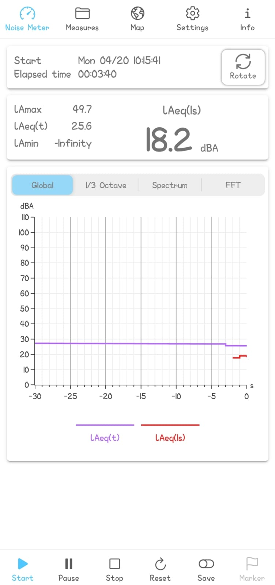
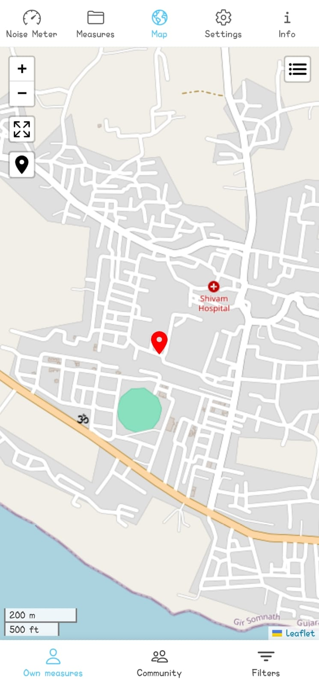
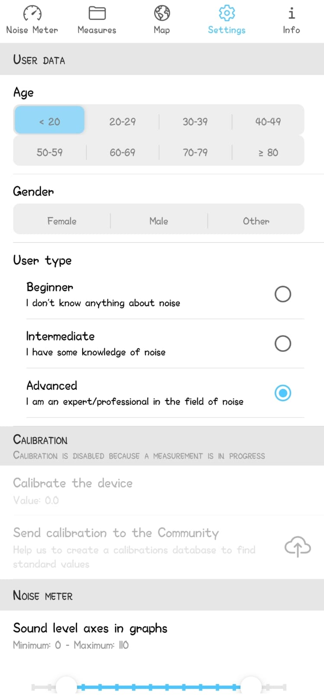
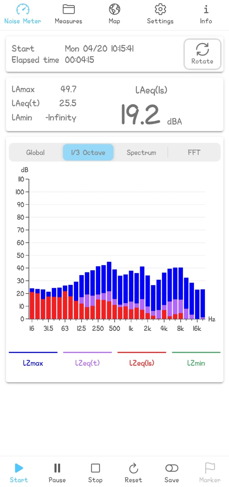
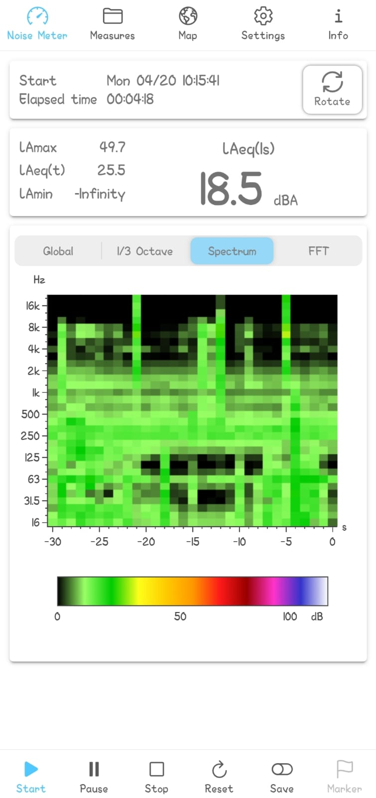
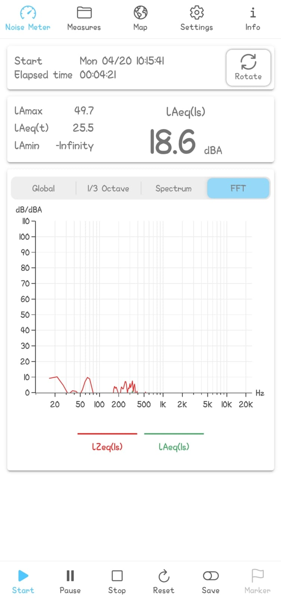

# 🔊 LDCE Noise Tracker

<p align="center">
  
</p>

<p align="center">
  <strong>A real-time noise measurement app for mobile devices</strong><br/>
  Built with Ionic + Angular + Capacitor
</p>

<p align="center">
  <a href="https://www.gnu.org/licenses/gpl-3.0.html"></a>
  
  
  
  
</p>

---

## 📖 About

**LDCE Noise Tracker** is a cross-platform mobile application that turns your smartphone into a sound level meter. It measures real-time sound pressure levels, performs frequency analysis, and helps users understand noise pollution in their environment.

> ⚠️ **Disclaimer:** This app is intended for educational and informational purposes. It is not a replacement for a professional-grade sound level meter. Each device responds differently to acoustic signals, so calibration is required for reliable readings.

---

## 📸 Screenshots

<p align="center">
  
  
  
  
  
  
</p>

---

## ✨ Features

### 🎙️ Noise Meter
- **Real-time measurement** of linear Z and A-weighted sound pressure levels
- Live display of **LAeq(1s)**, **LAeq(t)**, **LAmin**, **LAmax** and more
- Configurable **countdown timer** before measurement starts
- **Pause / Resume / Reset** controls
- **Auto-start** measurement on app launch

### 📊 Analysis & Visualization
- **Global Level** — Time-series chart of LAeq(1s), LAeq(t), LAmin, LAmax
- **1/3 Octave** — Frequency spectrum in 1/3 octave bands (LZeq, LZmin, LZmax)
- **Sonogram** — Spectrogram visualization of LZeq(1s) levels
- **FFT** — Constant-bandwidth frequency spectrum (Fast Fourier Transform)
- Interactive charts powered by **Plotly.js**

### 📁 Data Management
- Save measurements to **CSV / TXT** files
- Configurable decimal & field separators
- Insert **markers** to tag events of interest
- **Rename**, **delete**, **share** measurement files
- **Metadata compilation** — environment, source type, weather, feeling, etc.

### 🗺️ Map
- Visualize geolocated measurements on an interactive **Leaflet** map
- View your own measurements and community data
- Filter by **own measures** or **community** submissions
- **Marker clustering** for dense data points

### ⚙️ Settings & Calibration
- **Device calibration** with step-by-step instructions
- Customizable **Y-axis range** for charts
- **Screen orientation** lock
- **Light / Dark / Auto** theme modes
- **Frequency range** configuration

### 🌐 Community
- **Anonymously share** calibration values and measurements
- Contribute to noise pollution research and citizen science
- All shared data visible on the community map

### 🔒 Privacy
- **No personal data** collected (no names, emails, or phone numbers)
- **No audio recording** — only sound level values are processed locally
- GPS data used **only** when you choose to save or share a measurement

---

## 🛠️ Tech Stack

| Layer | Technology |
|-------|-----------|
| **Framework** | [Ionic 8](https://ionicframework.com/) + [Angular 19](https://angular.dev/) |
| **Native Runtime** | [Capacitor 7](https://capacitorjs.com/) |
| **Charts** | [Plotly.js](https://plotly.com/javascript/) |
| **Maps** | [Leaflet](https://leafletjs.com/) + [Leaflet.markercluster](https://github.com/Leaflet/Leaflet.markercluster) |
| **Audio Processing** | [cordova-plugin-audioinput](https://github.com/niclaslindstedt/cordova-plugin-audioinput) + [fourier-transform](https://www.npmjs.com/package/fourier-transform) |
| **PDF Viewer** | [ng2-pdf-viewer](https://www.npmjs.com/package/ng2-pdf-viewer) |
| **Language** | TypeScript 5.6 |
| **Platform** | Android (via Capacitor) |

---

## 📂 Project Structure

```
LDCE_Noice_Tracker/
├── android/                  # Android native project (Capacitor)
├── src/
│   ├── app/
│   │   ├── components/       # Reusable UI components
│   │   ├── pages/
│   │   │   ├── noisemeter/   # Main noise measurement screen
│   │   │   ├── map/          # Leaflet map with measurements
│   │   │   ├── savedata/     # Saved measurement files
│   │   │   ├── settings/     # App settings & calibration
│   │   │   ├── info/         # About, credits, glossary, tutorial
│   │   │   └── tabs/         # Tab navigation layout
│   │   └── services/         # Angular services (preferences, data)
│   ├── assets/
│   │   ├── i18n/             # English (en.json) & Italian (it.json) translations
│   │   └── icon/             # SVG icons
│   └── theme/                # Global styles & Ionic theme variables
├── www/                      # Built web assets (output directory)
├── capacitor.config.ts       # Capacitor configuration
├── angular.json              # Angular CLI configuration
├── package.json              # Dependencies & scripts
└── LICENSE                   # GNU GPLv3
```

---

## 🚀 Getting Started

### Prerequisites

- [Node.js](https://nodejs.org/) (v18 or later)
- [npm](https://www.npmjs.com/) (v9 or later)
- [Android Studio](https://developer.android.com/studio) (for Android builds)
- [Java JDK 17](https://adoptium.net/) (required by Gradle)

### Installation

```bash
# 1. Clone the repository
git clone https://github.com/Development-With-Dev/LDCE_Noice_Tracker.git
cd LDCE_Noice_Tracker

# 2. Install dependencies
npm install

# 3. Build the web assets
npx ng build

# 4. Sync with Android project
npx cap sync android
```

### Running on Android

```bash
# Open in Android Studio
npx cap open android
```

Then build and run from Android Studio on a connected device or emulator.

### Development Server (Browser)

```bash
npm start
```

Navigate to `http://localhost:4200/`. The app will automatically reload on file changes.

> **Note:** Audio capture features require a physical device and will not work in the browser.

---

## 📱 Building the APK

```bash
# 1. Production build
npx ng build --configuration production

# 2. Sync to Android
npx cap sync android

# 3. Open Android Studio and build APK
npx cap open android
```

In Android Studio: **Build → Build Bundle(s) / APK(s) → Build APK(s)**

The generated APK will be located at:
```
android/app/build/outputs/apk/debug/app-debug.apk
```

---

## 🌍 Localization

The app supports **English** and **Italian** translations. Translation files are located in:

```
src/assets/i18n/
├── en.json    # English
└── it.json    # Italian
```

To add a new language, create a new JSON file following the same structure and register it in the app.

---

## 👥 Team

| # | Name |
|---|------|
| 1 | **Dev Gondaliya** |
| 2 | **Jigar Ghoghari** |
| 3 | **Dev Bhavsar** |
| 4 | **Dev Letwala** |
| 5 | **Kaushal Yadav** |

**Institution:** L.D. College of Engineering (LDCE), Ahmedabad, Gujarat, India

---

## 📄 License

This project is licensed under the **GNU General Public License v3.0** — see the [LICENSE](LICENSE) file for details.

```
LDCE Noise Tracker - A noise measurement app for mobile devices
Copyright (C) 2026  Dev Gondaliya

This program is free software: you can redistribute it and/or modify
it under the terms of the GNU General Public License as published by
the Free Software Foundation, either version 3 of the License, or
(at your option) any later version.
```

---

## 📬 Contact

For bug reports, suggestions, or contributions:

📧 **gondaliyadev007@gmail.com**

🔗 **GitHub:** [github.com/Development-With-Dev/LDCE_Noice_Tracker](https://github.com/Development-With-Dev/LDCE_Noice_Tracker)

---

<p align="center">
  Made with ❤️ at LDCE, Ahmedabad
</p>
